<div align="center">

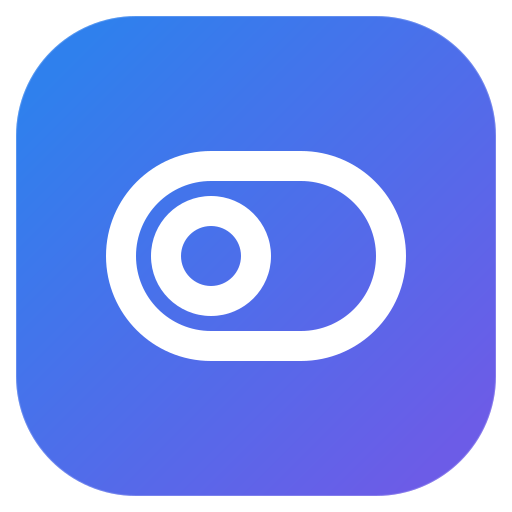

# Fluxa

**Essential macOS system controls, one click away in your menu bar.**

Built in **Swift + SwiftUI**, with Apple system frameworks and Sparkle 2 for Direct app updates.


[](https://github.com/zEhmsy/fluxa/releases/latest)
[](https://github.com/zEhmsy/fluxa/releases)
[](https://zehmsy.github.io/fluxa/)
[](LICENSE)


[**⬇ Download**](https://github.com/zEhmsy/fluxa/releases/latest) · [**Website**](https://zehmsy.github.io/fluxa/) · [Features](#-features) · [Install](#-installation) · [Architecture](#-architecture) · [Support](#-support)

<a href="https://www.buymeacoffee.com/gturturro">
  
</a>

</div>

---

## 🖼 Interface

<p align="center">
  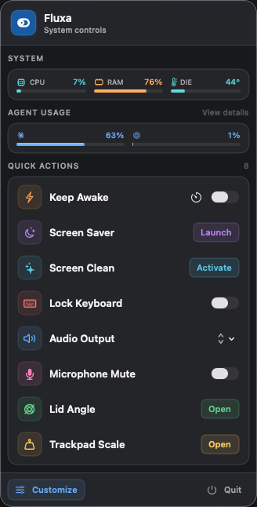
  &nbsp;&nbsp;
  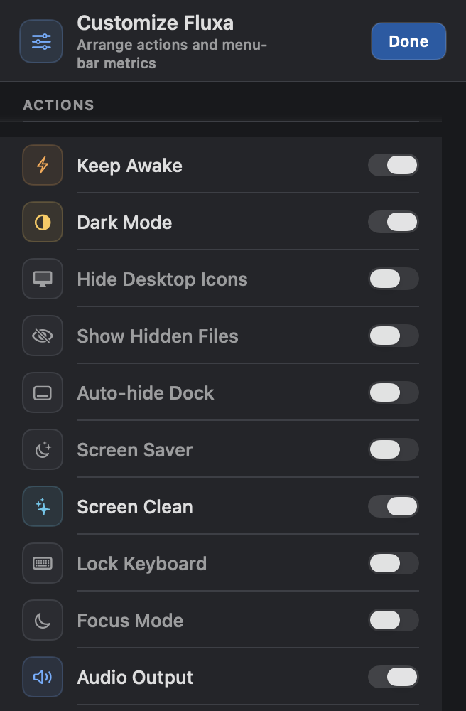
  &nbsp;&nbsp;
  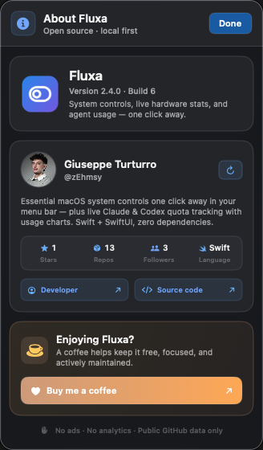
</p>

<p align="center"><sub>Customize groups preferences into General, Actions, System, Agents and Updates. About fits version details, updates and support into one screen; both stay inside the menu-bar panel.</sub></p>

> Customize, About and Agent Usage screenshots show **2.6.2 (13)** in Cyber Dark. The current
> release is **2.7.0**; the System and Actions tab captures below predate the disk/network
> readings and URL Cleaner action added in that release.

<details>
<summary>Explore the Actions, System, Agents and Updates tabs</summary>

<table>
  <tr>
    <th>Actions</th>
    <th>System</th>
  </tr>
  <tr>
    <td valign="top">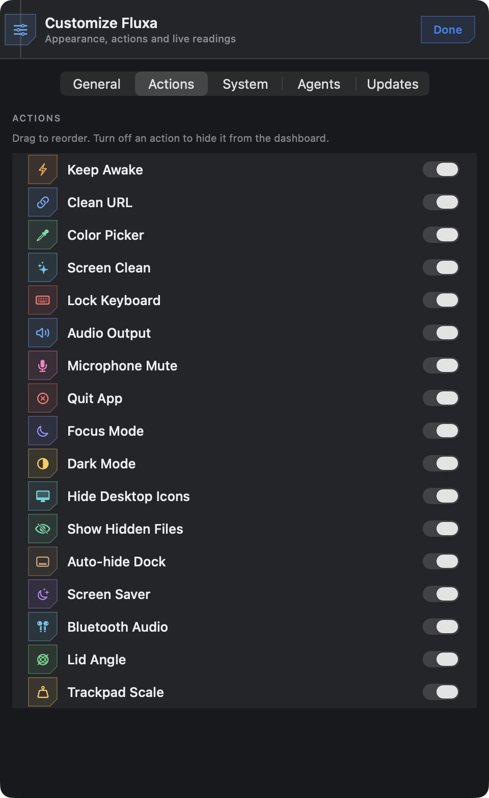</td>
    <td valign="top">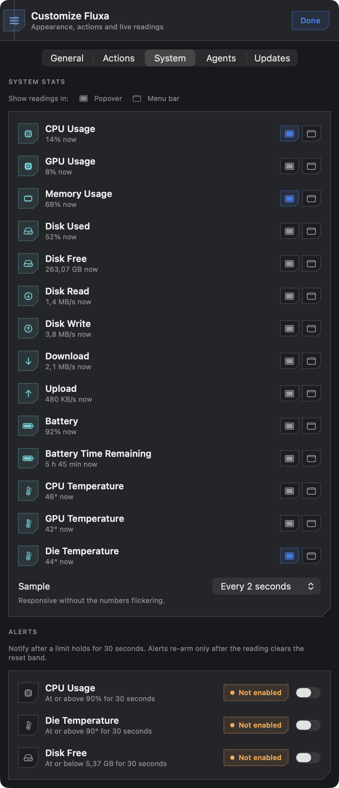</td>
  </tr>
  <tr>
    <th>Agents</th>
    <th>Updates</th>
  </tr>
  <tr>
    <td valign="top">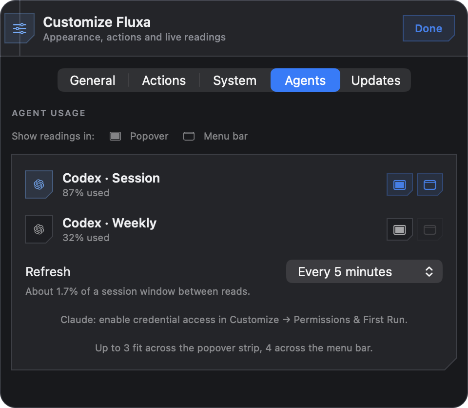</td>
    <td valign="top">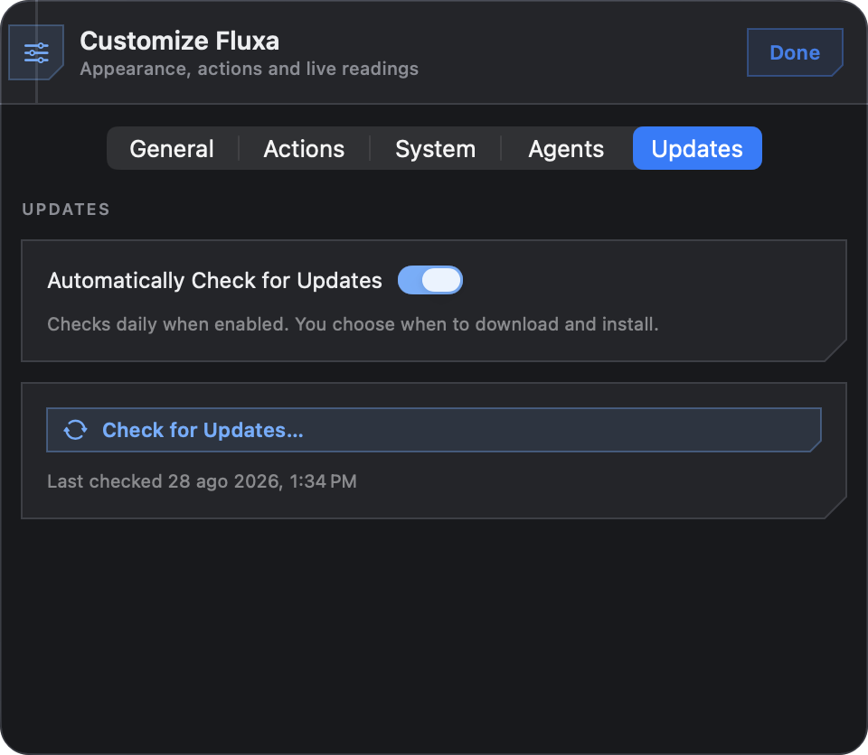</td>
  </tr>
</table>

</details>

<p align="center">
  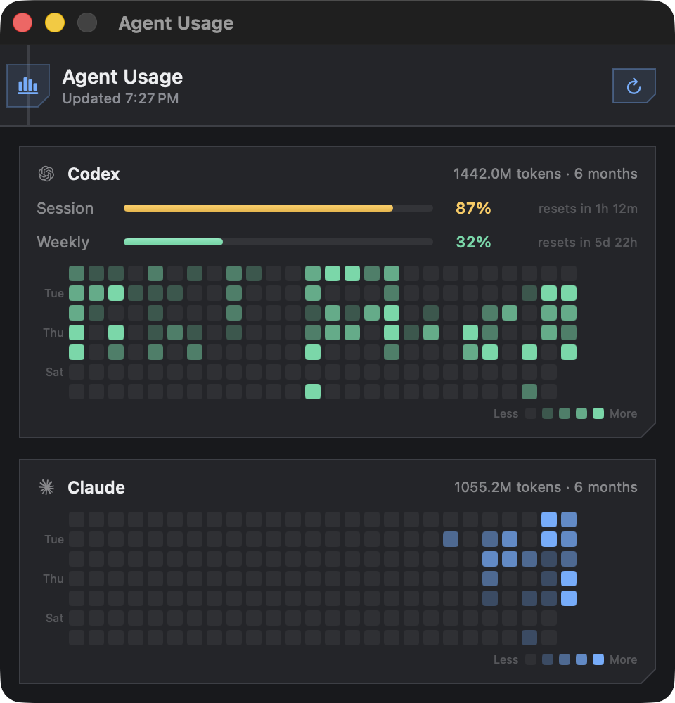
</p>

<p align="center"><sub>Agent Usage sizes its window to the quota readings and full contribution grids. Live quota availability depends on each provider's connection and permissions.</sub></p>

<p align="center">
  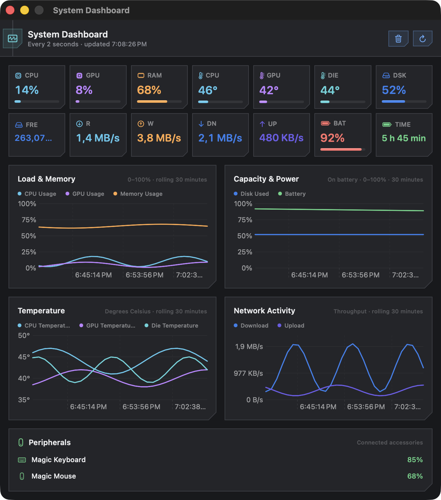
</p>

<p align="center"><sub>Live hardware readings expand into a rolling 30-minute dashboard with separate percentage and temperature scales.</sub></p>

<p align="center">
  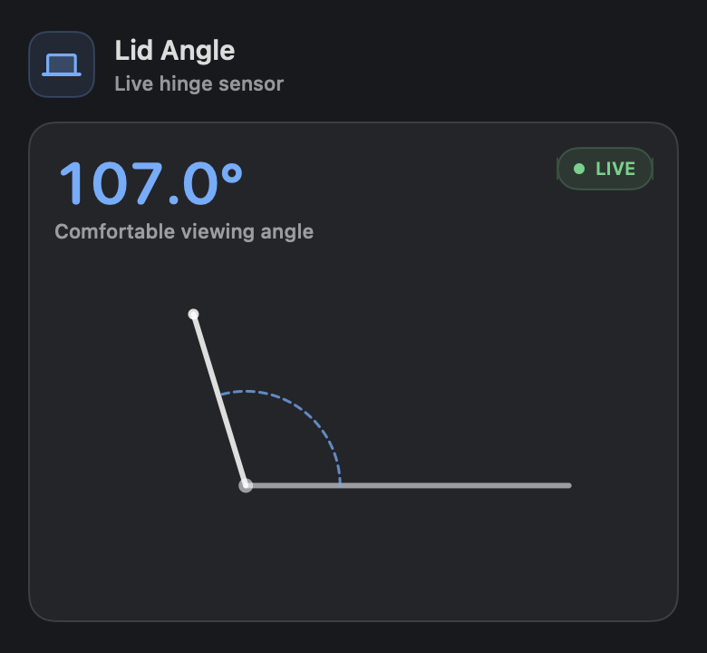
  &nbsp;&nbsp;
  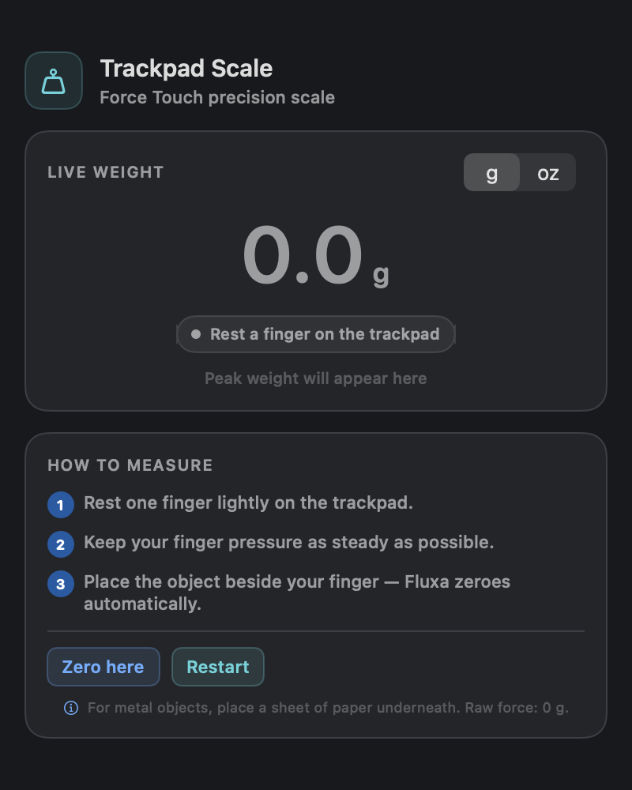
</p>

<p align="center"><sub>Hardware tools open as focused, purpose-built windows with the same adaptive visual system.</sub></p>

---

## ✨ Features

Sixteen quick actions, every one backed by a real system API — no fake toggles.

| Action | Type | Description |
|--------|------|-------------|
| ⚡ **Keep Awake** | Toggle + Timer | Prevents display sleep via IOKit power assertion — indefinitely or for 15 min / 1 h / 4 h with auto-off |
| 🌗 **Dark Mode** | Toggle | Switches the system appearance instantly |
| 🖥 **Hide Desktop Icons** | Toggle | Hides/shows Finder desktop icons for clean screenshots & presentations |
| 👁 **Show Hidden Files** | Toggle | Reveals dotfiles in Finder |
| 📥 **Auto-hide Dock** | Toggle | Shows the Dock only on hover |
| 🌙 **Screen Saver** | Button | Launches the system screen saver |
| ✨ **Screen Clean** | Button | Full-screen black overlay on every display; exits by click or ESC and follows display changes |
| ⌨️ **Lock Keyboard** | Toggle | Blocks keyboard input globally until its toggle is switched off; the mouse stays available to unlock |
| 🎯 **Focus Mode** | Toggle | Enables/disables Do Not Disturb via user-created Shortcuts |
| 🔊 **Audio Output** | Menu | Switches audio output device with one click, hot-plug aware |
| 🎧 **Bluetooth Audio** | Menu | Connects/disconnects paired AirPods & headphones — no Bluetooth menu digging |
| 🎤 **Microphone Mute** | Toggle | Mutes/unmutes the default input device via CoreAudio |
| 📐 **Lid Angle** | Window | Live MacBook lid angle readout straight from the hinge sensor (Apple Silicon & Intel) |
| ⚖️ **Trackpad Scale** | Window | Weighs small objects on the Force Touch trackpad's strain gauges |
| 📊 **Agent Usage** | Strip + Window | Live Claude & Codex quota percentages in the menu bar, with usage charts |
| 🔗 **Clean URL** | Button | Strips tracking parameters (`utm_*`, `fbclid`, `gclid`…) from the clipboard's URL, with host-specific rules for YouTube, Amazon and X |

### Beyond the actions

- **Customizable layout** — five settings tabs keep appearance, actions, hardware readings, agent quotas and updates separate; reorder, show or hide actions in the Actions tab
- **Focus-safe navigation** — Customize transitions in place while hardware tools reliably come to the foreground
- **Three visual styles** — Classic keeps the adaptive native interface; Cyber and Cyber Dark apply the Control Deck design across the popover and every tool window
- **Per-action color design** — tinted icon tiles that fill when a toggle is active
- **Persistent preferences** — order, visibility, and states survive relaunches
- **Menu bar native** — no Dock icon; pinned readings use the whole status item, while the Fluxa mark appears only when no metric is selected
- **Multi-display safe** — Screen Clean covers every connected display and rebuilds its overlays after a monitor is connected, disconnected, or rearranged; Keyboard Lock filters input globally
- **Global shortcut & launch at login** built in
- **About & support page** — version, live public GitHub details, update checks and an optional Buy Me a Coffee link in one view

---

## 🖥 System dashboard

Fluxa can pin live hardware readings in the popover, in the menu bar, or in both places:

- **CPU, GPU and memory usage** — local system counters shown as percentages
- **Temperature** — CPU/GPU readings when the Mac labels sensors per component, otherwise one honest whole-die reading
- **Disk** — used percentage on the boot volume (with the same severity coloring as CPU/GPU/memory), free space, and read/write throughput
- **Network** — combined download/upload throughput across active Wi-Fi and Ethernet interfaces
- **Independent destinations** — up to three readings in the popover and four total system/agent readings in the menu bar
- **Live history window** — click the system strip for separate load and temperature charts covering the latest 30 minutes
- **In-memory by design** — chart history starts when Fluxa launches and is never written to disk
- **Configurable sampling** — 1, 2, 5 or 10 seconds; the dashboard uses the same loop and never doubles the sensor work

CPU, GPU, memory and disk-used-percentage share a fixed 0–100% chart. Temperature uses a separate
degree axis so neither unit is visually compressed. Disk free space, disk throughput and network
throughput are unbounded readings — the dashboard shows them as plain numbers rather than forcing
them into a percentage-shaped meter. A failed sensor pass creates a gap in the history instead of
repeating an old value as though it had been measured again.

---

## 📊 Agent usage

Fluxa reads how much of your AI coding agents' quota you've burned and keeps it in the menu bar.

```
 ✳ 74%   19%              ← one compact reading per pinned agent
```

- **Menu bar strip** — each selected agent's mark and percentage, rendered as one template image so it tints itself for light and dark menu bars; no redundant Fluxa icon while readings are visible
- **Popover strip** — the same readings with severity colors (blue → amber at 75% → red at 90%) and a meter per window
- **Charts window** — click the strip: live quota meters plus a GitHub-style contribution grid of tokens spent per day
- **Configurable in Customize → Agents** — pick up to three quota windows and the refresh interval

### Where the numbers come from

Two different sources, because they answer different questions.

**Live quotas** come from each agent's own usage endpoint — the same ones its CLI calls:

| Agent | Endpoint | Credentials |
|-------|----------|-------------|
| Claude | `GET api.anthropic.com/api/oauth/usage` | `~/.claude/.credentials.json`, else the `Claude Code-credentials` keychain item |
| Codex | `GET chatgpt.com/backend-api/wham/usage` | `~/.codex/auth.json` |

**Fluxa never refreshes or rewrites those credentials.** Both providers rotate the refresh token when it's used, so renewing one here would invalidate the token Claude Code or Codex is holding — breaking the very login being read. An expired token is reported as expired; running the agent once mints a fresh one.

**Historical charts** come from the agents' own session logs (`~/.claude/projects/**/*.jsonl`, `~/.codex/sessions/**/*.jsonl`), which already hold exact per-turn token counts going back weeks. That's why the grid is populated the first time you open it instead of slowly filling from the day you enable it.

Aggregation details that matter for correctness:

- Days are bucketed by **local** calendar day, not UTC — bucketing by UTC moves an evening's work to the next day for anyone east of Greenwich
- Claude turns are de-duplicated on `message.id`: resumed sessions and sidechains replay the same turn into the log
- Codex `token_count` events whose cumulative total hasn't moved are re-emitted stale snapshots, not new work, and are skipped

Scanning is cached per file in `~/Library/Application Support/Fluxa/`. Session logs are append-only, so a file whose size and modification date are unchanged is never re-read — only the sessions being written right now.

### Privacy

Everything stays on your Mac. Fluxa talks to the agents' usage endpoints for quota reads and, only
when About is opened, to GitHub's public API for the developer/repository card. The Buy Me a Coffee
page opens in your browser only after you click it. There is no analytics, telemetry, or Fluxa server
of any kind. Token counts, the scan cache, and your preferences live in
`~/Library/Application Support/Fluxa/` and `UserDefaults`, never in the repository or a release artifact.

### Refresh interval

The choices are derived from what the data can express, not round numbers. A 5-hour session window spends 100 percentage points over 300 minutes, so at a steady burn **one percentage point takes three minutes** — polling faster cannot return a different integer, it only spends requests.

| Setting | Movement between reads |
|---------|------------------------|
| Only when opened | Menu bar can lag behind |
| Every 3 minutes | The fastest that can show a new number |
| Every 5 minutes *(default)* | ≈1.7% of a session window |
| Every 15 / 30 minutes | ≈5% / ≈10% of a session window |
| Every hour | Fine for weekly limits, coarse for a session |

---

## 📦 Installation

### Download (recommended)

Grab the **DMG** from the [latest release](https://github.com/zEhmsy/fluxa/releases/latest), open it,
and drag **Fluxa.app** into **Applications**. New packages use the name **Fluxa.dmg**; older releases
include the version in the filename.

> ⚠️ **Gatekeeper note** — Fluxa is ad-hoc signed, not notarized. If macOS blocks the first
> opening, verify the download's origin, try opening the installed copy, then use
> **System Settings → Privacy & Security → Open Anyway**, if offered. Do not disable Gatekeeper
> or override malware/damaged-app warnings. [Apple's guidance](https://support.apple.com/102445).
> The setup wizard can only run **after** macOS allows the app to open.

The first successful launch offers an optional permissions guide, also available from
**Customize → SETUP → Permissions & First Run**. The English [first-launch guide](docs/First%20Launch.txt)
can be read before opening the app. DMGs built with `./package-dmg.sh` include it beside Fluxa.app
as **Read Me First.txt**, in a Retina installer with Fluxa's blue–violet gradient and a clear
drag-to-Applications layout. The already published v2.5.0 DMG is unchanged.

### Build from source

```bash
git clone https://github.com/zEhmsy/fluxa.git
cd fluxa
./build.sh
cp -r Fluxa.app /Applications/
```

The `build.sh` script builds an arm64 release binary and assembles a signed `.app` bundle,
including the SwiftPM resources and the complete pinned Sparkle framework/helpers. The working
source contains the live HTTPS feed and public signing key; no private key is needed to compile.
The `--development` option only permits an unconfigured build when both trust fields are absent;
such a bundle has no updater and cannot be packaged for distribution. See
[Updates](docs/Updates.md) for signing and release steps. Keep `Package.resolved` in version control.

<details>
<summary>Compiler-only checks</summary>

```bash
swift build -c debug --arch arm64 -Xswiftc -warnings-as-errors
swift build -c release --arch arm64 -Xswiftc -warnings-as-errors
```

</details>

Use `build.sh` to assemble a runnable app; copying the standalone SwiftPM executable is not
sufficient to distribute Sparkle. Build scripts do not launch or install Fluxa.

### Requirements

- **macOS 14 (Sonoma)** or later
- **Xcode Command Line Tools** (building from source only)

### Package a release DMG

DMG packaging uses an isolated Python environment with pinned build-time tools, separate from
the app's Sparkle runtime dependency. On macOS, set up the tools once:

```bash
python3 -m venv .build/dmg-tools-venv
.build/dmg-tools-venv/bin/python3 -m pip install -r packaging/requirements.txt
```

For a new authorized release, set the version/build in `Info.plist`, then package a **default-signed
public build**, not the installed local-stable copy:

```bash
./build.sh
./package-dmg.sh
```

The script writes `Fluxa.dmg`, mounted as **Fluxa** with no version in the installer title. The app
retains its version/build metadata for update checks. Packaging verifies integrity and updater trust settings, prints
the SHA-256 and refuses to overwrite an existing file or distribute the weaker local identifier-only
signature. It does not
publish to GitHub or change the installed app. To prepare an unreleased design preview without
replacing an existing release artifact, use `./package-dmg.sh --output Fluxa-installer-preview.dmg`.
Output paths are relative to the repo; an existing parent directory is required.

The [Finder layout](packaging/dmg-settings.py) is generated directly, without AppleScript, Finder
automation or extra privacy prompts. It includes native app/Applications icons and the first-launch
guide. `build.sh` embeds the background in the app **before signing**, and
[the packager](packaging/build-dmg.py) points Finder at that signed resource. There are no loose
background/volume-icon files to cover the design when **Show Hidden Files** is enabled; the mounted
disk uses its native icon. Finder's global preferences are never changed.

The [editable SVG](packaging/dmg-background.svg) and its rendered TIFF use an 800 × 600-point canvas,
including bleed around a 760 × 520-point content area. The 760 × 584-point window reserves room for
Finder's global path/status bars. The TIFF includes both standard and Retina representations.
After changing the artwork, regenerate it with `./packaging/render-background.sh`, then rebuild the
app before packaging. Rendering requires
`librsvg`, available via `brew install librsvg`, and the macOS Futura font. Normal packaging uses
the checked-in TIFF and does not need the renderer.

### Direct updates

Fluxa **2.7.0** integrates Sparkle **2.9.4**. About includes **Check for Updates…** and
Customize keeps automatic-check consent/state under its **Updates** tab. Downloads and installation require confirmation;
the updater's windows are independent of the menu-bar popover. Updates use an
[HTTPS feed](https://zehmsy.github.io/fluxa/updates/appcast.xml) and Ed25519-signed archives.

**Upgrading from v2.5.0 or earlier:** install the new DMG manually once. Those versions do not
include Sparkle. The first updater-enabled release is [v2.6.1](https://github.com/zEhmsy/fluxa/releases/tag/v2.6.1);
existing installs are offered each subsequent version through the feed. The owner completed a real
build 9 → 10 update before the 2.6.1 release; that ZIP preserves the accepted bytes and remains
downloadable at its original URL. The [product site](https://zehmsy.github.io/fluxa/) now serves the
Pages root, with the feed unchanged at `/fluxa/updates/appcast.xml`.

A separate `Fluxa.zip`, made with `./package-update.sh --output path/to/Fluxa.zip`, contains the
same signed bundle as the approved `Fluxa.dmg`. Each newly packaged ZIP needs an Ed25519 signature
and an appcast; scripts do not publish automatically. See [the update/signing runbook](docs/Updates.md)
for key custody, immutable download URLs and the upgrade checklist.

---

## 🔐 Permissions

The first-run guide explains each permission and lets you request it individually, or skip it.
Opening the guide does not request access. It remains open while you use System Settings and checks
the system's current status when you return. Saved onboarding choices are **not** treated as permission grants.

| Permission | Used by | When |
|-----------|---------|------|
| **Automation (System Events)** | Dark Mode | Allow button in setup, or first toggle; setup reads appearance without changing it |
| **Bluetooth** | Bluetooth Audio | Allow button in setup; startup does not enumerate devices without access |
| **Accessibility** | Lock Keyboard | Enable button in setup; required to intercept keyboard events globally |
| **Shortcuts app** | Focus Mode | One-time guided setup (see below) |
| **Keychain** | Agent Usage (Claude) | Connect Claude in setup opts into credential access for the current signing identity; choose *Always Allow* only if you trust this copy |
| **Network** | Agent Usage / About | Agent quota endpoints; public GitHub profile data only while About is opened |

No Full Disk Access, Screen Recording or microphone-recording permission is needed for these controls.
Claude credentials are never rewritten or refreshed. Background reads request a noninteractive
authentication context and require an earlier explicit opt-in for the current signing requirement;
denial/cancellation clears that opt-in, preventing retry loops. This preference is not a Keychain grant.
macOS can still require renewed approval after a signing change, revocation or policy change.

> **Permission prompts during development.** A normal ad-hoc requirement changes when the binary
> changes. Prefer a stable certificate-backed development identity when available:
> ```bash
> CODESIGN_IDENTITY="Apple Development: you@example.com" ./build.sh
> ```
> For repeated local-only builds without a certificate, `FLUXA_STABLE_LOCAL_REQUIREMENT=1 ./build.sh`
> keeps the designated requirement stable. That identifier-only fallback is intentionally opt-in and
> must not be used for a public release artifact.

### Focus Mode setup

macOS has no public API to toggle Do Not Disturb, so Fluxa runs two Shortcuts you create once — a guided wizard opens on first use:

1. **Open Shortcuts** from the wizard
2. Create **"Fluxa Focus On"** → action *Set Focus: Turn On*
3. Create **"Fluxa Focus Off"** → action *Set Focus: Turn Off*
4. Tap **Done** — Fluxa remembers the setup

If the shortcuts are ever deleted, Fluxa detects it and re-opens the wizard.

### Sandbox & App Store

Fluxa is **not sandboxed** and cannot ship on the Mac App Store: IOKit assertions,
CoreAudio device control, IOBluetooth, and `defaults`/`killall` all require direct
system access. Built for power users, by design.

---

## 🏗 Architecture

MVVM with a single `@Observable` ViewModel coordinating focused, concrete services — no unnecessary abstractions.

```
Sources/FluxaCore/                   # Pure Swift library, no AppKit/SwiftUI — testable in isolation
├── Models/
│   ├── SystemMetric.swift           # System metric identity, kind, value, severity
│   ├── SystemStatsHistory.swift      # Sparse timestamped samples for charts
│   ├── SystemStatsInterval.swift     # Local sampling intervals
│   ├── AgentUsage.swift             # AgentUsageMetric: one agent quota window
│   └── UsageRefreshInterval.swift   # Agent poll intervals derived from window size
└── Services/
    ├── SystemStats/                  # CPU, GPU, memory, thermal, disk and network samplers
    ├── URLCleaner.swift              # Tracking-parameter stripping rules (pure function)
    └── FluxaError.swift             # Centralized error types

Sources/Fluxa/
├── App/
│   ├── FluxaApp.swift               # @main, MenuBarExtra + focused Window scenes
│   ├── FluxaWindowPresenter.swift   # Window registration + foreground activation
│   └── AppDelegate.swift            # Cleanup on termination
├── Models/
│   ├── QuickAction.swift            # ActionID, ControlStyle, tints, ActionCatalog
│   ├── AppSettings.swift            # @Observable, UserDefaults persistence
│   └── FluxaVisualStyle.swift       # Classic / Cyber / Cyber Dark
├── ViewModels/
│   └── PopoverViewModel.swift       # Central coordinator, owns all services
├── Views/
│   ├── PopoverRootView.swift        # Root container (header, list, bottom bar)
│   ├── FluxaTheme.swift             # Adaptive palette + shared UI components
│   ├── ActionListView.swift         # Action list
│   ├── ActionRowView.swift          # Row: toggle / timed toggle / button / menu
│   ├── CustomizeView.swift          # General, Actions, System, Agents and Updates tabs
│   ├── InfoView.swift               # About, public GitHub details + support link
│   ├── BottomBarView.swift          # Customize + About + Quit
│   ├── FocusOnboardingView.swift    # Focus Mode setup wizard
│   ├── LidAngleWindowView.swift     # Animated lid-angle goniometer
│   ├── TrackpadScaleWindowView.swift# Force Touch scale readout
│   ├── SystemStatsStripView.swift    # Live hardware strip under the header
│   ├── SystemStatsWindowView.swift   # 30-minute load, temperature, disk and network readings
│   ├── AgentUsageStripView.swift    # Quota strip under the popover header
│   ├── AgentUsageWindowView.swift   # Quota meters + contribution grids
│   ├── ContributionGridView.swift   # GitHub-style calendar of daily tokens
│   ├── MenuBarStripRenderer.swift   # Menu bar image: mark + system/agent readings
│   └── AgentMarks.swift             # Vector agent logos, template-rendered
├── Services/
│   ├── KeepAwakeService.swift       # IOKit power assertion + expiry timer
│   ├── DarkModeService.swift        # System Events via osascript
│   ├── DesktopIconService.swift     # Finder defaults + killall
│   ├── FinderHiddenFilesService.swift
│   ├── DockAutohideService.swift
│   ├── ScreenSaverService.swift     # NSWorkspace → ScreenSaverEngine
│   ├── ScreenCleanService.swift     # Hot-plug-aware NSPanel overlay on every display
│   ├── KeyboardShieldService.swift  # NSPanel + local event monitor
│   ├── FocusModeService.swift       # /usr/bin/shortcuts CLI
│   ├── AudioOutputService.swift     # CoreAudio enumeration & switching
│   ├── MicrophoneMuteService.swift  # CoreAudio input volume control
│   ├── BluetoothAudioService.swift  # IOBluetooth paired-device connect
│   ├── LidAngleMonitor.swift        # HID sensor (Apple Silicon) + IORegistry (Intel)
│   ├── TrackpadWeightService.swift  # MultitouchSupport via dlopen, grams from pressure
│   ├── SystemStatsService.swift      # Live readings + in-memory chart history
│   ├── URLCleanerService.swift      # Clipboard read/write around FluxaCore's URLCleaner
│   ├── GitHubProfileService.swift    # Public About-page data, no token required
│   ├── AgentCredentials.swift       # Read-only Claude/Codex credential lookup
│   ├── AgentUsageReaders.swift      # Per-agent usage endpoints & mapping
│   ├── AgentUsageService.swift      # Orchestration, polling, selection
│   ├── AgentLogScanner.swift        # Daily tokens from session logs (cached)
│   ├── GlobalShortcutService.swift  # Carbon hotkey
│   ├── LaunchAtLoginService.swift   # SMAppService
│   └── ShellRunner.swift            # Shared Process helper
└── Resources/
    ├── fluxa.icns                   # App icon
    ├── menu-icon.pdf                # Menu bar switch mark (from new-icon.svg)
    ├── AgentIcons/                  # Agent marks as vector PDFs + their SVG sources
    └── Info.plist                   # LSUIElement, permissions text, metadata

Tests/FluxaCoreTests/                # Swift Testing, covers FluxaCore only
```

### Design principles

- **MVVM** — views observe one `@Observable` ViewModel; services are implementation details
- **MainActor isolation** — UI state and services run on the main actor; blocking calls (Bluetooth connect) hop off it
- **In-panel navigation** — Customize swaps views inside the `MenuBarExtra`; dedicated tools stay separate and activate in front
- **Adaptive design system** — one semantic palette keeps hierarchy and contrast consistent in Aqua and Dark Aqua
- **Honest UX** — if an API doesn't exist, the app says so instead of faking a toggle
- **Zero dependencies** — SwiftUI, AppKit, IOKit, CoreAudio, IOBluetooth, ApplicationServices. Nothing else.

### API limitations & trade-offs

| Area | Limitation | Workaround |
|------|-----------|------------|
| Focus Mode | No public DND/Focus API | User-created Shortcuts + optimistic local state |
| Dark Mode | No public appearance API | System Events scripting (Automation permission) |
| Keyboard Lock | Requires Accessibility and a session event tap | Use the Permissions guide; there is no local-monitor fallback |
| Lid Angle | Sensor API differs by platform | HID feature report on Apple Silicon, IORegistry on Intel |
| Desktop icons / hidden files | Need a Finder restart | `killall Finder` — brief flicker is expected |
| App Sandbox | Incompatible with the above | Ad-hoc signing; not App Store eligible |
| Trackpad Scale | Trackpad reports force only under a capacitive touch | Rest a finger on it, place the object beside it; the strain gauges measure total load |
| Trackpad Scale | `NSEvent.pressure` only fires during a click | Reads `MultitouchSupport` via `dlopen`; layout is validated at runtime, feature hides itself if it changes |
| Agent quotas | Refresh tokens rotate on use | Read-only: an expired token is reported, never renewed behind the agent's back |
| Agent history | No history endpoint exists | Rebuilt from the agents' own session logs |
| Codex history | Child sessions replay a parent's history | Not filtered — measured at 0.08% on one day out of nine |
| Temperatures | Later SoCs do not label die sensors by component | Show one Die Temperature instead of inventing separate CPU/GPU values |
| System history | macOS provides live counters, not an app history log | Keep a rolling 30 minutes in memory; history resets on relaunch |
| Disk throughput | Sums every attached block-storage driver, not just the boot volume | Stated simplification — an external drive's activity is included; isolating the boot volume needs its specific IOMedia provider chain |
| Network throughput | Only counts `en*` interfaces (Wi-Fi, Ethernet, Thunderbolt Ethernet) | An unrecognized adapter reads as no traffic rather than a wrong number, matching every other sensor's "no fake reading" rule |

---

## 🛠 Development

```bash
swift build                                  # debug build
swift run Fluxa                              # run directly
swift build -c release                       # release build
swift build -Xswiftc -warnings-as-errors     # what build.sh enforces
```

Regenerate the app icon from code:

```bash
swift generate_icon.swift
cp fluxa.icns Sources/Fluxa/Resources/
```

Regenerate the vector marks after editing an SVG (needs `rsvg-convert`, e.g. `brew install librsvg`):

```bash
rsvg-convert -f pdf -o Sources/Fluxa/Resources/menu-icon.pdf new-icon.svg
rsvg-convert -f pdf -o Sources/Fluxa/Resources/AgentIcons/claude.pdf \
  Sources/Fluxa/Resources/AgentIcons/claude.svg
```

---

## ☕ Support

If Fluxa saves you a few clicks every day, you can fuel the next feature:

<a href="https://www.buymeacoffee.com/gturturro">
  
</a>

---

<p align="center">
  <sub>Built with Swift and caffeine.</sub>
</p>
